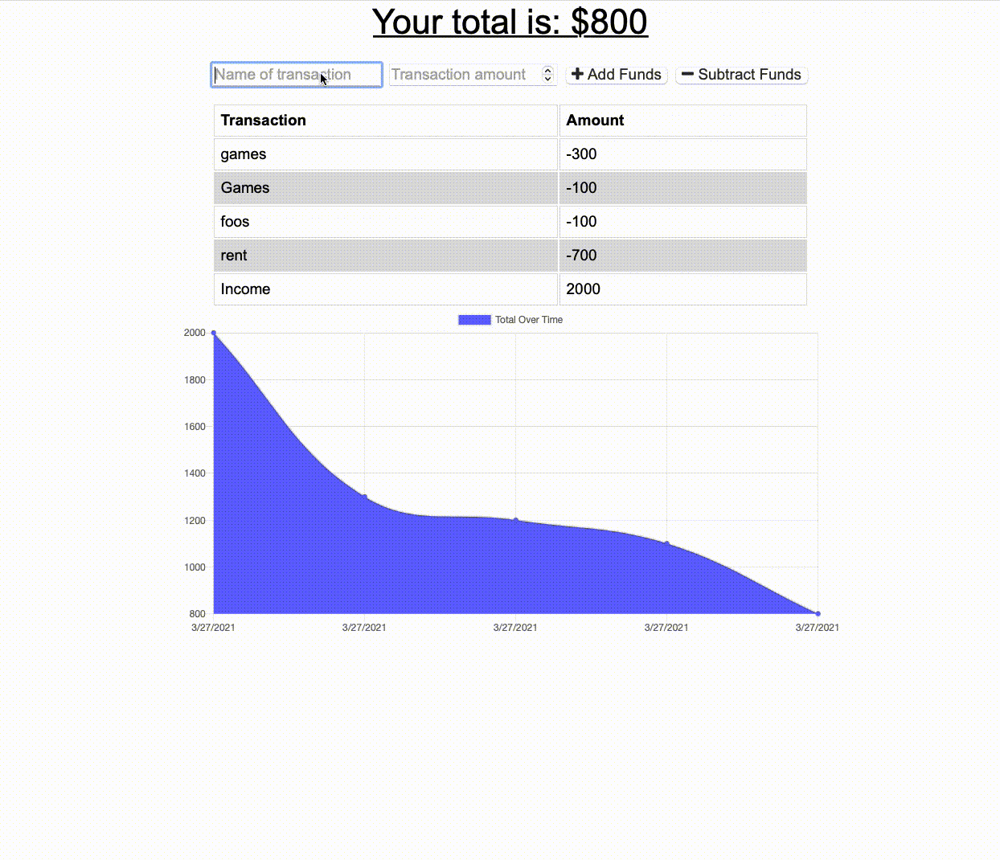

# Budget-Tracker
Track your spending and saving

## [Application](https://serene-earth-03250.herokuapp.com)

# Description 
Users can use this app to record income and expenses and see their flow of cash over time. 

# Use

- Enter the name of the transaction
- Enter the amount of the transaction
- Click add funds if you are depositing money, or click subtract funds if you paid for something. 
- Below is a line graph that shows the flow of money into and out of your account over time. 

# Technologies Used
- Node.js
- Javscript
- HTML
- CSS
- Chart.js
- Express.js
- MongoDB
- indexDB

# License
This application uses the MIT license. 

# Challenges
The most challenging part was encoutnering an issue with user access to mongodb through atlas.  The original user I made wasn't working, however, making another user with the same parameters worked.  Not sure what the issue was, but this was the fix for the issue.  

# Future Development 
In the future I would like to add the following features: 

- Categorize expednitures. 
- user authentication
- have reoccuring expednitures that you don't have to manually enter.  
